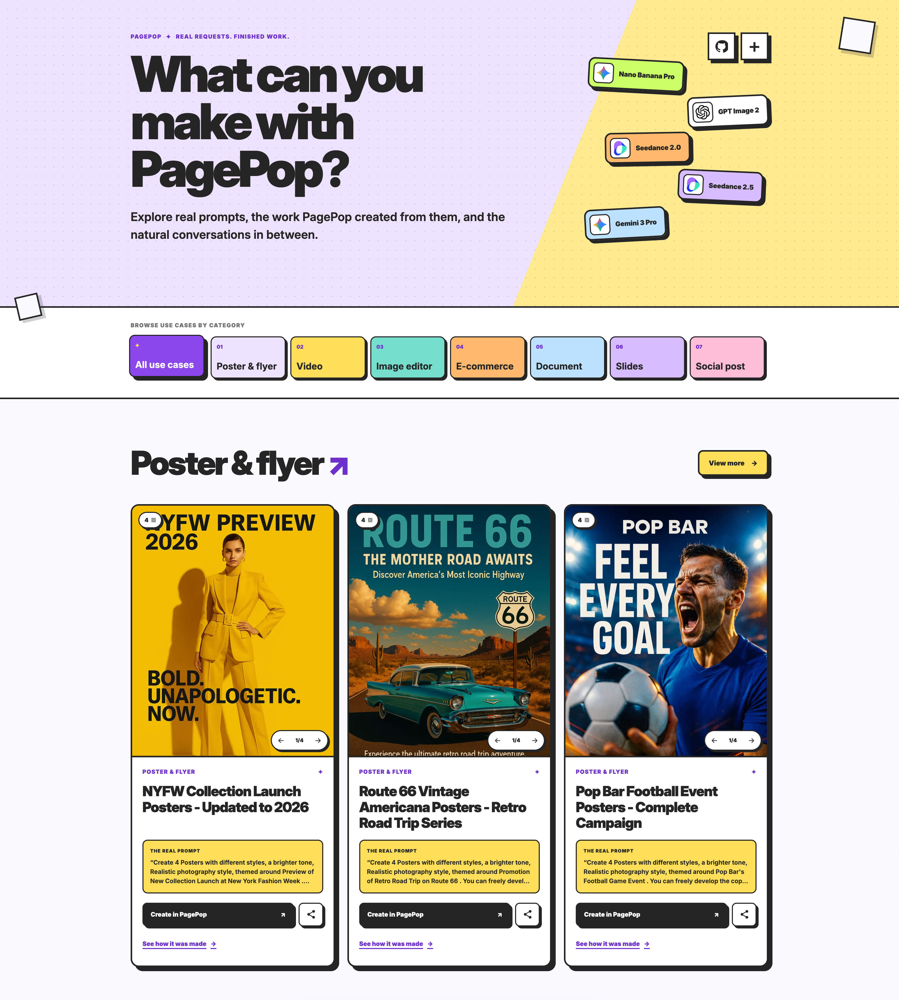

<!-- This file is generated by scripts/generate-readme.mjs. Do not edit it manually. -->

<p align="center">
  <a href="https://www.pagepop.ai/use-cases?utm_source=github&utm_medium=referral&utm_campaign=awesome-ai-prompts-and-use-cases&utm_content=repository-banner"></a>
</p>

# Awesome AI Creative Prompts & Real-World Use Cases

[](CONTRIBUTING.md)

> **Real requests. Natural-language prompts. Finished creative work.**
>
> A curated PagePop collection showing the exact prompt that started each project and the result it produced—without requiring specialized prompt engineering.

<p align="center">
  
</p>

<p align="center">
  <a href="https://www.pagepop.ai/use-cases?utm_source=github&utm_medium=referral&utm_campaign=awesome-ai-prompts-and-use-cases&utm_content=hero"><strong>Browse the visual gallery on PagePop →</strong></a>
</p>

## Models used by PagePop

PagePop combines leading creative models and automatically selects the right implementation for the requested result:

**Nano Banana Pro** · **GPT Image 2** · **Seedance 2.0** · **Seedance 2.5** · **Gemini 3 Pro**

<a id="browse-all-prompts-and-use-cases"></a>

## Browse all prompts and use cases

The prompt collections published in this repository are included below. Use the category links or search this page with <kbd>Ctrl</kbd>/<kbd>⌘</kbd> + <kbd>F</kbd>.

| Category | Full category page | Visual gallery |
| --- | --- | --- |
| 🎬 [Video](#video) | [Open category README](prompts/video/README.md) | [Browse on PagePop](https://www.pagepop.ai/use-cases/categories/video?utm_source=github&utm_medium=referral&utm_campaign=awesome-ai-prompts-and-use-cases&utm_content=category-video) |
| 🪧 [Poster & Flyer](#poster-and-flyer) | [Open category README](prompts/posters-and-flyers/README.md) | [Browse on PagePop](https://www.pagepop.ai/use-cases/categories/poster-and-flyer?utm_source=github&utm_medium=referral&utm_campaign=awesome-ai-prompts-and-use-cases&utm_content=category-poster-and-flyer) |
| 🪄 [Image Editor](#image-editor) | [Open category README](prompts/image-editing/README.md) | [Browse on PagePop](https://www.pagepop.ai/use-cases/categories/image-editor?utm_source=github&utm_medium=referral&utm_campaign=awesome-ai-prompts-and-use-cases&utm_content=category-image-editor) |
| 🛍️ [E-commerce](#e-commerce) | [Open category README](prompts/ecommerce/README.md) | [Browse on PagePop](https://www.pagepop.ai/use-cases/categories/e-commerce?utm_source=github&utm_medium=referral&utm_campaign=awesome-ai-prompts-and-use-cases&utm_content=category-e-commerce) |
| 📊 [Slides](#slides) | [Open category README](prompts/presentations/README.md) | [Browse on PagePop](https://www.pagepop.ai/use-cases/categories/slides?utm_source=github&utm_medium=referral&utm_campaign=awesome-ai-prompts-and-use-cases&utm_content=category-slides) |
| 📱 [Social Post](#social-post) | [Open category README](prompts/social-media/README.md) | [Browse on PagePop](https://www.pagepop.ai/use-cases/categories/social-post?utm_source=github&utm_medium=referral&utm_campaign=awesome-ai-prompts-and-use-cases&utm_content=category-social-post) |

---

<a id="video"></a>

## 🎬 AI Video Prompts & Use Cases

[Browse the Video gallery on PagePop →](https://www.pagepop.ai/use-cases/categories/video?utm_source=github&utm_medium=referral&utm_campaign=awesome-ai-prompts-and-use-cases&utm_content=category-heading-video)

### Aroma Diffuser Promo Video

<p align="center">
  <a href="https://img-volc.jianpian.info/super/video_concat/video/40932350/1779193256874_40932350_GoXHN.mp4"></a>
  <br>
  <strong><a href="https://img-volc.jianpian.info/super/video_concat/video/40932350/1779193256874_40932350_GoXHN.mp4">▶ Play video (MP4)</a></strong>
</p>

**Output:** Video

#### Original prompt

```text
The picture is of my product - the aroma diffuser. The original details of the product remain unchanged. An e-commerce promotional video is to be generated, lasting 10 seconds, in 720p resolution, with a 16:9 aspect ratio.
```

**[View the complete creative process →](https://www.pagepop.ai/use-cases/aroma-diffuser-promo-video?utm_source=github&utm_medium=referral&utm_campaign=awesome-ai-prompts-and-use-cases&utm_content=case-aroma-diffuser-promo-video)** · **[Create in PagePop →](https://www.pagepop.ai/use-cases/aroma-diffuser-promo-video?utm_source=github&utm_medium=referral&utm_campaign=awesome-ai-prompts-and-use-cases&utm_content=create-aroma-diffuser-promo-video)**

---

### Comedy Tank Standoff

<p align="center">
  <a href="https://img-volc.jianpian.info/super/video_concat/video/40932350/1779188152384_40932350_6QX1Y.mp4"></a>
  <br>
  <strong><a href="https://img-volc.jianpian.info/super/video_concat/video/40932350/1779188152384_40932350_6QX1Y.mp4">▶ Play video (MP4)</a></strong>
</p>

**Output:** Video

#### Original prompt

```text
Generate a video with a comedy scene set in a living room at home. A little girl and a dog are sitting inside a toy tank with serious and focused expressions. Opposite them, a small kitten is standing on a coffee table, creating a funny standoff between the two sides. Warm family environment, bright lighting, cartoon comedy style, and a humorous atmosphere.  15s，720p
```

**[View the complete creative process →](https://www.pagepop.ai/use-cases/comedy-tank-standoff?utm_source=github&utm_medium=referral&utm_campaign=awesome-ai-prompts-and-use-cases&utm_content=case-comedy-tank-standoff)** · **[Create in PagePop →](https://www.pagepop.ai/use-cases/comedy-tank-standoff?utm_source=github&utm_medium=referral&utm_campaign=awesome-ai-prompts-and-use-cases&utm_content=create-comedy-tank-standoff)**

---

### Dolphin Sunset Transition

<p align="center">
  <a href="https://img-volc.jianpian.info/super/video_concat/video/40932350/1779188490823_40932350_HEDLy.mp4"></a>
  <br>
  <strong><a href="https://img-volc.jianpian.info/super/video_concat/video/40932350/1779188490823_40932350_HEDLy.mp4">▶ Play video (MP4)</a></strong>
</p>

**Output:** Video

#### Original prompt

```text
Generate a video based on the reference image I provided. Start underwater with a group of dolphins swimming through clear blue ocean water, then smoothly transition as the camera rises toward the surface and moves into a peaceful wide ocean sunset view. Make the video feel magical, relaxing, and inspiring, like a beautiful nature documentary moment. Keep the movement smooth and natural, with gentle light rays, flowing water, and a calm emotional atmosphere.
```

**[View the complete creative process →](https://www.pagepop.ai/use-cases/dolphin-sunset-transition?utm_source=github&utm_medium=referral&utm_campaign=awesome-ai-prompts-and-use-cases&utm_content=case-dolphin-sunset-transition)** · **[Create in PagePop →](https://www.pagepop.ai/use-cases/dolphin-sunset-transition?utm_source=github&utm_medium=referral&utm_campaign=awesome-ai-prompts-and-use-cases&utm_content=create-dolphin-sunset-transition)**

---

### Grandma Moon's Sweet Dream

<p align="center">
  <a href="https://img-volc.jianpian.info/super/video_concat/video/41202504/1779077874120_41202504_QlZU4.mp4"></a>
  <br>
  <strong><a href="https://img-volc.jianpian.info/super/video_concat/video/41202504/1779077874120_41202504_QlZU4.mp4">▶ Play video (MP4)</a></strong>
</p>

**Output:** Video

#### Original prompt

```text
Generate a cartoon video:
"Grandma Moon’s Sweet Dream"

At night, the moon hung high in the sky.

Bunny Sister said,
“Grandma Moon likes children who go to sleep early the most.”

Kitten Sister asked,
“Why?”

Bunny Sister said,
“Because when you go to sleep early, Grandma Moon will send you a sweet dream.”

As soon as Kitten Sister heard that, she quickly lay down.

She closed her eyes and said,
“Grandma Moon, I’m all tucked in.”

Before long, Kitten Sister fell asleep.
She dreamed that she was sitting in a little moon boat, rocking gently and smiling happily.

The next morning, Kitten Sister said happily,
“Bunny Sister, I really did get a sweet dream!”
```

**[View the complete creative process →](https://www.pagepop.ai/use-cases/grandma-moons-sweet-dream?utm_source=github&utm_medium=referral&utm_campaign=awesome-ai-prompts-and-use-cases&utm_content=case-grandma-moons-sweet-dream)** · **[Create in PagePop →](https://www.pagepop.ai/use-cases/grandma-moons-sweet-dream?utm_source=github&utm_medium=referral&utm_campaign=awesome-ai-prompts-and-use-cases&utm_content=create-grandma-moons-sweet-dream)**

---

### Kitten Sister's Clean Teeth

<p align="center">
  <a href="https://img-volc.jianpian.info/super/video_concat/video/41202504/1779077682990_41202504_9YgVT.mp4"></a>
  <br>
  <strong><a href="https://img-volc.jianpian.info/super/video_concat/video/41202504/1779077682990_41202504_9YgVT.mp4">▶ Play video (MP4)</a></strong>
</p>

**Output:** Video

#### Original prompt

```text
Generate a cartoon video:

At night, after Kitten Sister finished her little cookies, she wanted to go to sleep.

Bunny Sister said, “Wait a moment, there are still little cookie bits hiding in your tiny teeth.”

Kitten Sister opened her mouth wide and asked, “Where are they?”

Bunny Sister smiled and said, “Let the little toothbrush go find them.”

Kitten Sister picked up her toothbrush and brushed, brush, brush.

She brushed the top, the bottom, the inside, and the outside.

Bunny Sister said, “Look, all the little cookie bits are gone now.”

Kitten Sister said happily, “My teeth are nice and clean now. I can go to sleep!”
```

**[View the complete creative process →](https://www.pagepop.ai/use-cases/kitten-sisters-clean-teeth?utm_source=github&utm_medium=referral&utm_campaign=awesome-ai-prompts-and-use-cases&utm_content=case-kitten-sisters-clean-teeth)** · **[Create in PagePop →](https://www.pagepop.ai/use-cases/kitten-sisters-clean-teeth?utm_source=github&utm_medium=referral&utm_campaign=awesome-ai-prompts-and-use-cases&utm_content=create-kitten-sisters-clean-teeth)**

---

### Quirky Object Transformations

<p align="center">
  <a href="https://img-volc.jianpian.info/super/video_concat/video/40932350/1779175905311_40932350_fm3Zt.mp4"></a>
  <br>
  <strong><a href="https://img-volc.jianpian.info/super/video_concat/video/40932350/1779175905311_40932350_fm3Zt.mp4">▶ Play video (MP4)</a></strong>
</p>

**Output:** Video

#### Original prompt

```text
Help me create a 15-second funny video that is suitable for posting on social media platforms. The style should be quirky and easy to attract clicks.
```

**[View the complete creative process →](https://www.pagepop.ai/use-cases/quirky-object-transformations?utm_source=github&utm_medium=referral&utm_campaign=awesome-ai-prompts-and-use-cases&utm_content=case-quirky-object-transformations)** · **[Create in PagePop →](https://www.pagepop.ai/use-cases/quirky-object-transformations?utm_source=github&utm_medium=referral&utm_campaign=awesome-ai-prompts-and-use-cases&utm_content=create-quirky-object-transformations)**

---

<a id="poster-and-flyer"></a>

## 🪧 Poster & Flyer Prompts & Use Cases

[Browse the Poster & Flyer gallery on PagePop →](https://www.pagepop.ai/use-cases/categories/poster-and-flyer?utm_source=github&utm_medium=referral&utm_campaign=awesome-ai-prompts-and-use-cases&utm_content=category-heading-poster-and-flyer)

### Academic Conference Poster - Mangrove Rodent Eradication Technology

<p align="center">
  <a href="https://www.pagepop.ai/use-cases/academic-conference-poster-mangrove-rodent-eradication-technology?utm_source=github&utm_medium=referral&utm_campaign=awesome-ai-prompts-and-use-cases&utm_content=case-academic-conference-poster-mangrove-rodent-eradication-technology"></a>
</p>

**Output:** Image

#### Original prompt

```text
Invasive rodents have been successfully eradicated from islandsworldwide,
restoring native species and their habitats, boosting island resilience tCo
climate change and supporting social wellbeing. There is growing interest in
large-scale eradications but many tropical islands are unable to ireap the
benefits of rodent eradication due to technological gaps in baiting largge areas
of mangrove forest, a common habitat of tropical islands. An emergin09
product is bait bolas (bait pellets connected by string), which, on
deployment, entangle in the mangrove canopy, preventing themfrom being
washed away, ensuring the rats can access it. Scaling-up the useof bolas
requires mechanisation of bola production and the developmentof a method
to aerially deploy bolas effectively, without the bolas getting entangled with
one another. The estimated cost of developing mangrove baitingtechnology
is around US$850,000. We estimate that a combined total of around two
million hectares of biodiverse tropical island could become feasilble for
eradication were this technology available. We call on beneficiariies and
philanthropists to invest in this technology now, to unlock significant
biodiversity and climate resilience gains.
Create an academic conference poster that includes infographicsand
sections according to the paper attached
```

**[View the complete creative process →](https://www.pagepop.ai/use-cases/academic-conference-poster-mangrove-rodent-eradication-technology?utm_source=github&utm_medium=referral&utm_campaign=awesome-ai-prompts-and-use-cases&utm_content=case-academic-conference-poster-mangrove-rodent-eradication-technology)** · **[Create in PagePop →](https://www.pagepop.ai/use-cases/academic-conference-poster-mangrove-rodent-eradication-technology?utm_source=github&utm_medium=referral&utm_campaign=awesome-ai-prompts-and-use-cases&utm_content=create-academic-conference-poster-mangrove-rodent-eradication-technology)**

---

### American Frontier Western Wagon Prints - 4 Artistic Styles

<p align="center">
  <a href="https://www.pagepop.ai/use-cases/american-frontier-western-wagon-prints-4-artistic-styles?utm_source=github&utm_medium=referral&utm_campaign=awesome-ai-prompts-and-use-cases&utm_content=case-american-frontier-western-wagon-prints-4-artistic-styles"></a>
</p>

**Output:** Image

#### Original prompt

```text
Create 4 prints with different styles, a brighter tone, themed around American Frontier Era Western Wagon Scene Print . You can freely develop the copy on the prints or leave them without any copy.
```

**[View the complete creative process →](https://www.pagepop.ai/use-cases/american-frontier-western-wagon-prints-4-artistic-styles?utm_source=github&utm_medium=referral&utm_campaign=awesome-ai-prompts-and-use-cases&utm_content=case-american-frontier-western-wagon-prints-4-artistic-styles)** · **[Create in PagePop →](https://www.pagepop.ai/use-cases/american-frontier-western-wagon-prints-4-artistic-styles?utm_source=github&utm_medium=referral&utm_campaign=awesome-ai-prompts-and-use-cases&utm_content=create-american-frontier-western-wagon-prints-4-artistic-styles)**

---

### Brooklyn Bridge Urban Landscape Prints - 4 Style Variations

<p align="center">
  <a href="https://www.pagepop.ai/use-cases/brooklyn-bridge-urban-landscape-prints-4-style-variations?utm_source=github&utm_medium=referral&utm_campaign=awesome-ai-prompts-and-use-cases&utm_content=case-brooklyn-bridge-urban-landscape-prints-4-style-variations"></a>
</p>

**Output:** Image

#### Original prompt

```text
Create 4 prints with different styles, a brighter tone, themed around Brooklyn Bridge (New York) Urban Landscape Print . You can freely develop the copy on the prints or leave them without any copy.
```

**[View the complete creative process →](https://www.pagepop.ai/use-cases/brooklyn-bridge-urban-landscape-prints-4-style-variations?utm_source=github&utm_medium=referral&utm_campaign=awesome-ai-prompts-and-use-cases&utm_content=case-brooklyn-bridge-urban-landscape-prints-4-style-variations)** · **[Create in PagePop →](https://www.pagepop.ai/use-cases/brooklyn-bridge-urban-landscape-prints-4-style-variations?utm_source=github&utm_medium=referral&utm_campaign=awesome-ai-prompts-and-use-cases&utm_content=create-brooklyn-bridge-urban-landscape-prints-4-style-variations)**

---

### Country Music Legends Portrait Prints - 4 Styles

<p align="center">
  <a href="https://www.pagepop.ai/use-cases/country-music-legends-portrait-prints-4-styles?utm_source=github&utm_medium=referral&utm_campaign=awesome-ai-prompts-and-use-cases&utm_content=case-country-music-legends-portrait-prints-4-styles"></a>
</p>

**Output:** Image

#### Original prompt

```text
Create 4 prints with different styles, a brighter tone, themed around  Portrait Print of Legendary American Country Music Singers. You can freely develop the copy on the prints or leave them without any copy.
```

**[View the complete creative process →](https://www.pagepop.ai/use-cases/country-music-legends-portrait-prints-4-styles?utm_source=github&utm_medium=referral&utm_campaign=awesome-ai-prompts-and-use-cases&utm_content=case-country-music-legends-portrait-prints-4-styles)** · **[Create in PagePop →](https://www.pagepop.ai/use-cases/country-music-legends-portrait-prints-4-styles?utm_source=github&utm_medium=referral&utm_campaign=awesome-ai-prompts-and-use-cases&utm_content=create-country-music-legends-portrait-prints-4-styles)**

---

### Meritus Paramedical Institute Posters - Vertical Layout

<p align="center">
  <a href="https://www.pagepop.ai/use-cases/meritus-paramedical-institute-posters-vertical-layout?utm_source=github&utm_medium=referral&utm_campaign=awesome-ai-prompts-and-use-cases&utm_content=case-meritus-paramedical-institute-posters-vertical-layout"></a>
</p>

**Output:** Image

#### Original prompt

```text
please prepare a poster for my Meritus Paramedical Institute (MPI). please use
your knowledge to make this better. please use bigger fonts. itshould be
horizontal layout. Contact- [phone redacted], [phone redacted], Email-
[email redacted] address- [address redacted] eligibility 12th
or equivalent with any stream. course are DMLT, B.Sc MLT, B.VcC MLT, DOTT,
B.Sc OT, B.Voc OT, X-Ray technician, Dialysis technician & EmergencMedical
Technician Etc. please provide colorful and 4k quality
```

**[View the complete creative process →](https://www.pagepop.ai/use-cases/meritus-paramedical-institute-posters-vertical-layout?utm_source=github&utm_medium=referral&utm_campaign=awesome-ai-prompts-and-use-cases&utm_content=case-meritus-paramedical-institute-posters-vertical-layout)** · **[Create in PagePop →](https://www.pagepop.ai/use-cases/meritus-paramedical-institute-posters-vertical-layout?utm_source=github&utm_medium=referral&utm_campaign=awesome-ai-prompts-and-use-cases&utm_content=create-meritus-paramedical-institute-posters-vertical-layout)**

---

### New Orleans Jazz Prints - 4 Artistic Styles

<p align="center">
  <a href="https://www.pagepop.ai/use-cases/new-orleans-jazz-prints-4-artistic-styles?utm_source=github&utm_medium=referral&utm_campaign=awesome-ai-prompts-and-use-cases&utm_content=case-new-orleans-jazz-prints-4-artistic-styles"></a>
</p>

**Output:** Image

#### Original prompt

```text
Create 4 prints with different styles, a brighter tone, themed around New Orleans Jazz Music Element Decorative Print . You can freely develop the copy on the prints or leave them without any copy.
```

**[View the complete creative process →](https://www.pagepop.ai/use-cases/new-orleans-jazz-prints-4-artistic-styles?utm_source=github&utm_medium=referral&utm_campaign=awesome-ai-prompts-and-use-cases&utm_content=case-new-orleans-jazz-prints-4-artistic-styles)** · **[Create in PagePop →](https://www.pagepop.ai/use-cases/new-orleans-jazz-prints-4-artistic-styles?utm_source=github&utm_medium=referral&utm_campaign=awesome-ai-prompts-and-use-cases&utm_content=create-new-orleans-jazz-prints-4-artistic-styles)**

---

### NYC Street Art Exhibition Prints - 4 Distinct Styles

<p align="center">
  <a href="https://www.pagepop.ai/use-cases/nyc-street-art-exhibition-prints-4-distinct-styles?utm_source=github&utm_medium=referral&utm_campaign=awesome-ai-prompts-and-use-cases&utm_content=case-nyc-street-art-exhibition-prints-4-distinct-styles"></a>
</p>

**Output:** Image

#### Original prompt

```text
Create 4 prints with different styles, a brighter tone, themed around New York Street Art Exhibition Promotion . You can freely develop the copy on the prints or leave them without any copy.
```

**[View the complete creative process →](https://www.pagepop.ai/use-cases/nyc-street-art-exhibition-prints-4-distinct-styles?utm_source=github&utm_medium=referral&utm_campaign=awesome-ai-prompts-and-use-cases&utm_content=case-nyc-street-art-exhibition-prints-4-distinct-styles)** · **[Create in PagePop →](https://www.pagepop.ai/use-cases/nyc-street-art-exhibition-prints-4-distinct-styles?utm_source=github&utm_medium=referral&utm_campaign=awesome-ai-prompts-and-use-cases&utm_content=create-nyc-street-art-exhibition-prints-4-distinct-styles)**

---

### NYFW Collection Launch Posters - Updated to 2026

<p align="center">
  <a href="https://www.pagepop.ai/use-cases/nyfw-collection-launch-posters-updated-to-2026?utm_source=github&utm_medium=referral&utm_campaign=awesome-ai-prompts-and-use-cases&utm_content=case-nyfw-collection-launch-posters-updated-to-2026"></a>
</p>

**Output:** Image

#### Original prompt

```text
Create 4 Posters with different styles, a brighter tone, Realistic photography style, themed around Preview of New Collection Launch at New York Fashion Week . You can freely develop the copy on the Posters.
```

**[View the complete creative process →](https://www.pagepop.ai/use-cases/nyfw-collection-launch-posters-updated-to-2026?utm_source=github&utm_medium=referral&utm_campaign=awesome-ai-prompts-and-use-cases&utm_content=case-nyfw-collection-launch-posters-updated-to-2026)** · **[Create in PagePop →](https://www.pagepop.ai/use-cases/nyfw-collection-launch-posters-updated-to-2026?utm_source=github&utm_medium=referral&utm_campaign=awesome-ai-prompts-and-use-cases&utm_content=create-nyfw-collection-launch-posters-updated-to-2026)**

---

### Organic Produce Launch Prints - 4 Styles

<p align="center">
  <a href="https://www.pagepop.ai/use-cases/organic-produce-launch-prints-4-styles?utm_source=github&utm_medium=referral&utm_campaign=awesome-ai-prompts-and-use-cases&utm_content=case-organic-produce-launch-prints-4-styles"></a>
</p>

**Output:** Image

#### Original prompt

```text
Create 4 prints with different styles, a brighter tone, themed around Grocery Store New Product Launch . You can freely develop the copy on the prints or leave them without any copy.
```

**[View the complete creative process →](https://www.pagepop.ai/use-cases/organic-produce-launch-prints-4-styles?utm_source=github&utm_medium=referral&utm_campaign=awesome-ai-prompts-and-use-cases&utm_content=case-organic-produce-launch-prints-4-styles)** · **[Create in PagePop →](https://www.pagepop.ai/use-cases/organic-produce-launch-prints-4-styles?utm_source=github&utm_medium=referral&utm_campaign=awesome-ai-prompts-and-use-cases&utm_content=create-organic-produce-launch-prints-4-styles)**

---

### Pop Bar Football Event Posters - Complete Campaign

<p align="center">
  <a href="https://www.pagepop.ai/use-cases/pop-bar-football-event-posters-complete-campaign?utm_source=github&utm_medium=referral&utm_campaign=awesome-ai-prompts-and-use-cases&utm_content=case-pop-bar-football-event-posters-complete-campaign"></a>
</p>

**Output:** Image

#### Original prompt

```text
Create 4 Posters with different styles, a brighter tone, Realistic photography style, themed around Pop Bar's Football Game Event . You can freely develop the copy on the Posters.
```

**[View the complete creative process →](https://www.pagepop.ai/use-cases/pop-bar-football-event-posters-complete-campaign?utm_source=github&utm_medium=referral&utm_campaign=awesome-ai-prompts-and-use-cases&utm_content=case-pop-bar-football-event-posters-complete-campaign)** · **[Create in PagePop →](https://www.pagepop.ai/use-cases/pop-bar-football-event-posters-complete-campaign?utm_source=github&utm_medium=referral&utm_campaign=awesome-ai-prompts-and-use-cases&utm_content=create-pop-bar-football-event-posters-complete-campaign)**

---

### Route 66 Vintage Americana Posters - Retro Road Trip Series

<p align="center">
  <a href="https://www.pagepop.ai/use-cases/route-66-vintage-americana-posters-retro-road-trip-series?utm_source=github&utm_medium=referral&utm_campaign=awesome-ai-prompts-and-use-cases&utm_content=case-route-66-vintage-americana-posters-retro-road-trip-series"></a>
</p>

**Output:** Image

#### Original prompt

```text
Create 4 Posters with different styles, a brighter tone, Realistic photography style, themed around Promotion of Retro Road Trip on Route 66 . You can freely develop the copy on the Posters.
```

**[View the complete creative process →](https://www.pagepop.ai/use-cases/route-66-vintage-americana-posters-retro-road-trip-series?utm_source=github&utm_medium=referral&utm_campaign=awesome-ai-prompts-and-use-cases&utm_content=case-route-66-vintage-americana-posters-retro-road-trip-series)** · **[Create in PagePop →](https://www.pagepop.ai/use-cases/route-66-vintage-americana-posters-retro-road-trip-series?utm_source=github&utm_medium=referral&utm_campaign=awesome-ai-prompts-and-use-cases&utm_content=create-route-66-vintage-americana-posters-retro-road-trip-series)**

---

### Summer Sounds Fest 2027 Poster - Festival Design Collection

<p align="center">
  <a href="https://www.pagepop.ai/use-cases/summer-sounds-fest-2027-poster-festival-design-collection?utm_source=github&utm_medium=referral&utm_campaign=awesome-ai-prompts-and-use-cases&utm_content=case-summer-sounds-fest-2027-poster-festival-design-collection"></a>
</p>

**Output:** Image

#### Original prompt

```text
create a summer festival poster using this content. SUMNMER SOUNDS FEST
(Perth, WA)
SUMMER SOUNDS FEST 2027
Perth's Ultimate Summer Music Festival
January 1-3, 2027 • Langley Park, Perth WA
3 Days. 4 Stages . 40+ Artists • Beachfront Vibes
HEADLINERS:
Tame Impala
Flume
Fisher
The Kid LAROI
Peking Duk
Vera Blue
Tickets:
Weekend Pass: $300
Single Day: $125
VIP Camping Package: $550
Regular Camping Pass: $300
CAMP ON SITE . SUNSET STAGE · SILENT DISCO.FOOD TRUCK VILLAGE.
BEACH BAR
Get tickets now before prices rise!
www.summersoundsfest.com
```

**[View the complete creative process →](https://www.pagepop.ai/use-cases/summer-sounds-fest-2027-poster-festival-design-collection?utm_source=github&utm_medium=referral&utm_campaign=awesome-ai-prompts-and-use-cases&utm_content=case-summer-sounds-fest-2027-poster-festival-design-collection)** · **[Create in PagePop →](https://www.pagepop.ai/use-cases/summer-sounds-fest-2027-poster-festival-design-collection?utm_source=github&utm_medium=referral&utm_campaign=awesome-ai-prompts-and-use-cases&utm_content=create-summer-sounds-fest-2027-poster-festival-design-collection)**

---

<a id="image-editor"></a>

## 🪄 AI Image Editing Prompts & Use Cases

[Browse the Image Editor gallery on PagePop →](https://www.pagepop.ai/use-cases/categories/image-editor?utm_source=github&utm_medium=referral&utm_campaign=awesome-ai-prompts-and-use-cases&utm_content=category-heading-image-editor)

### Beach Beauty Clean Background

<p align="center">
  <a href="https://www.pagepop.ai/use-cases/beach-beauty-clean-background?utm_source=github&utm_medium=referral&utm_campaign=awesome-ai-prompts-and-use-cases&utm_content=case-beach-beauty-clean-background"></a>
</p>

**Output:** Image

#### Original prompt

```text
Eliminar a los transeúntes y escombros en el fondo, conservar solo las bellezas completas y dejar la playa limpia en el Fondo
```

**[View the complete creative process →](https://www.pagepop.ai/use-cases/beach-beauty-clean-background?utm_source=github&utm_medium=referral&utm_campaign=awesome-ai-prompts-and-use-cases&utm_content=case-beach-beauty-clean-background)** · **[Create in PagePop →](https://www.pagepop.ai/use-cases/beach-beauty-clean-background?utm_source=github&utm_medium=referral&utm_campaign=awesome-ai-prompts-and-use-cases&utm_content=create-beach-beauty-clean-background)**

---

### Beach Sunset Without Watermark

<p align="center">
  <a href="https://www.pagepop.ai/use-cases/beach-sunset-without-watermark?utm_source=github&utm_medium=referral&utm_campaign=awesome-ai-prompts-and-use-cases&utm_content=case-beach-sunset-without-watermark"></a>
</p>

**Output:** Image

#### Original prompt

```text
Remove watermarks from images
```

**[View the complete creative process →](https://www.pagepop.ai/use-cases/beach-sunset-without-watermark?utm_source=github&utm_medium=referral&utm_campaign=awesome-ai-prompts-and-use-cases&utm_content=case-beach-sunset-without-watermark)** · **[Create in PagePop →](https://www.pagepop.ai/use-cases/beach-sunset-without-watermark?utm_source=github&utm_medium=referral&utm_campaign=awesome-ai-prompts-and-use-cases&utm_content=create-beach-sunset-without-watermark)**

---

### Couple Bedroom Photo

<p align="center">
  <a href="https://www.pagepop.ai/use-cases/couple-bedroom-photo?utm_source=github&utm_medium=referral&utm_campaign=awesome-ai-prompts-and-use-cases&utm_content=case-couple-bedroom-photo"></a>
</p>

**Output:** Image

#### Original prompt

```text
Add a tall young handsome guy with bare upper body and eight pack abs to the left of the girl. The handsome guy hugs the girl's shoulder and looks affectionately at her, but she doesn't move
```

**[View the complete creative process →](https://www.pagepop.ai/use-cases/couple-bedroom-photo?utm_source=github&utm_medium=referral&utm_campaign=awesome-ai-prompts-and-use-cases&utm_content=case-couple-bedroom-photo)** · **[Create in PagePop →](https://www.pagepop.ai/use-cases/couple-bedroom-photo?utm_source=github&utm_medium=referral&utm_campaign=awesome-ai-prompts-and-use-cases&utm_content=create-couple-bedroom-photo)**

---

### Edited Photo

<p align="center">
  <a href="https://www.pagepop.ai/use-cases/edited-photo?utm_source=github&utm_medium=referral&utm_campaign=awesome-ai-prompts-and-use-cases&utm_content=case-edited-photo"></a>
</p>

**Output:** Image

#### Original prompt

```text
Remove the man on the left, don't change anything else
```

**[View the complete creative process →](https://www.pagepop.ai/use-cases/edited-photo?utm_source=github&utm_medium=referral&utm_campaign=awesome-ai-prompts-and-use-cases&utm_content=case-edited-photo)** · **[Create in PagePop →](https://www.pagepop.ai/use-cases/edited-photo?utm_source=github&utm_medium=referral&utm_campaign=awesome-ai-prompts-and-use-cases&utm_content=create-edited-photo)**

---

### Grand Finals Opening Poster

<p align="center">
  <a href="https://www.pagepop.ai/use-cases/grand-finals-opening-poster?utm_source=github&utm_medium=referral&utm_campaign=awesome-ai-prompts-and-use-cases&utm_content=case-grand-finals-opening-poster"></a>
</p>

**Output:** Image

#### Original prompt

```text
Modify the image by adding a large white title "GRAND FINALS OPENING" and a small font time of "9.2.2026" above the image
Add the Chinese subtitle "FIRST WHISTLE. FULL THOTTTLE." below the image
Image ratio 4:5
```

**[View the complete creative process →](https://www.pagepop.ai/use-cases/grand-finals-opening-poster?utm_source=github&utm_medium=referral&utm_campaign=awesome-ai-prompts-and-use-cases&utm_content=case-grand-finals-opening-poster)** · **[Create in PagePop →](https://www.pagepop.ai/use-cases/grand-finals-opening-poster?utm_source=github&utm_medium=referral&utm_campaign=awesome-ai-prompts-and-use-cases&utm_content=create-grand-finals-opening-poster)**

---

### Hiker on Snowy Peak

<p align="center">
  <a href="https://www.pagepop.ai/use-cases/hiker-on-snowy-peak?utm_source=github&utm_medium=referral&utm_campaign=awesome-ai-prompts-and-use-cases&utm_content=case-hiker-on-snowy-peak"></a>
</p>

**Output:** Image

#### Original prompt

```text
Cambia el Fondo por una montaña nevada y los personajes se paran en la cima de la montaña
```

**[View the complete creative process →](https://www.pagepop.ai/use-cases/hiker-on-snowy-peak?utm_source=github&utm_medium=referral&utm_campaign=awesome-ai-prompts-and-use-cases&utm_content=case-hiker-on-snowy-peak)** · **[Create in PagePop →](https://www.pagepop.ai/use-cases/hiker-on-snowy-peak?utm_source=github&utm_medium=referral&utm_campaign=awesome-ai-prompts-and-use-cases&utm_content=create-hiker-on-snowy-peak)**

---

### Kitten Raising Paw

<p align="center">
  <a href="https://www.pagepop.ai/use-cases/kitten-raising-paw?utm_source=github&utm_medium=referral&utm_campaign=awesome-ai-prompts-and-use-cases&utm_content=case-kitten-raising-paw"></a>
</p>

**Output:** Image

#### Original prompt

```text
Make the kitten sit up
```

**[View the complete creative process →](https://www.pagepop.ai/use-cases/kitten-raising-paw?utm_source=github&utm_medium=referral&utm_campaign=awesome-ai-prompts-and-use-cases&utm_content=case-kitten-raising-paw)** · **[Create in PagePop →](https://www.pagepop.ai/use-cases/kitten-raising-paw?utm_source=github&utm_medium=referral&utm_campaign=awesome-ai-prompts-and-use-cases&utm_content=create-kitten-raising-paw)**

---

### Manicura rosa con diamantes y lazos

<p align="center">
  <a href="https://www.pagepop.ai/use-cases/manicura-rosa-con-diamantes-y-lazos?utm_source=github&utm_medium=referral&utm_campaign=awesome-ai-prompts-and-use-cases&utm_content=case-manicura-rosa-con-diamantes-y-lazos"></a>
</p>

**Output:** Image

#### Original prompt

```text
Cambie a la mujer por una exagerada manicura rosa con diamantes y lazos en la manicura, el resto no cambie
```

**[View the complete creative process →](https://www.pagepop.ai/use-cases/manicura-rosa-con-diamantes-y-lazos?utm_source=github&utm_medium=referral&utm_campaign=awesome-ai-prompts-and-use-cases&utm_content=case-manicura-rosa-con-diamantes-y-lazos)** · **[Create in PagePop →](https://www.pagepop.ai/use-cases/manicura-rosa-con-diamantes-y-lazos?utm_source=github&utm_medium=referral&utm_campaign=awesome-ai-prompts-and-use-cases&utm_content=create-manicura-rosa-con-diamantes-y-lazos)**

---

### Modified Combat Photo

<p align="center">
  <a href="https://www.pagepop.ai/use-cases/modified-combat-photo?utm_source=github&utm_medium=referral&utm_campaign=awesome-ai-prompts-and-use-cases&utm_content=case-modified-combat-photo"></a>
</p>

**Output:** Image

#### Original prompt

```text
Modificar la foto, cambiar a los hombres por trajes y sombreros de combate, cambiar el Fondo por el campo de batalla donde ocurrió la explosión, otros no cambian
```

**[View the complete creative process →](https://www.pagepop.ai/use-cases/modified-combat-photo?utm_source=github&utm_medium=referral&utm_campaign=awesome-ai-prompts-and-use-cases&utm_content=case-modified-combat-photo)** · **[Create in PagePop →](https://www.pagepop.ai/use-cases/modified-combat-photo?utm_source=github&utm_medium=referral&utm_campaign=awesome-ai-prompts-and-use-cases&utm_content=create-modified-combat-photo)**

---

### Modified Poster

<p align="center">
  <a href="https://www.pagepop.ai/use-cases/modified-poster?utm_source=github&utm_medium=referral&utm_campaign=awesome-ai-prompts-and-use-cases&utm_content=case-modified-poster"></a>
</p>

**Output:** Image

#### Original prompt

```text
Change GUNS to LOVE and change the title color to white
```

**[View the complete creative process →](https://www.pagepop.ai/use-cases/modified-poster?utm_source=github&utm_medium=referral&utm_campaign=awesome-ai-prompts-and-use-cases&utm_content=case-modified-poster)** · **[Create in PagePop →](https://www.pagepop.ai/use-cases/modified-poster?utm_source=github&utm_medium=referral&utm_campaign=awesome-ai-prompts-and-use-cases&utm_content=create-modified-poster)**

---

### Niña con cabeza de conejo

<p align="center">
  <a href="https://www.pagepop.ai/use-cases/nina-con-cabeza-de-conejo?utm_source=github&utm_medium=referral&utm_campaign=awesome-ai-prompts-and-use-cases&utm_content=case-nina-con-cabeza-de-conejo"></a>
</p>

**Output:** Image

#### Original prompt

```text
Cambia la cabeza de la niña por una linda cabeza de conejo
```

**[View the complete creative process →](https://www.pagepop.ai/use-cases/nina-con-cabeza-de-conejo?utm_source=github&utm_medium=referral&utm_campaign=awesome-ai-prompts-and-use-cases&utm_content=case-nina-con-cabeza-de-conejo)** · **[Create in PagePop →](https://www.pagepop.ai/use-cases/nina-con-cabeza-de-conejo?utm_source=github&utm_medium=referral&utm_campaign=awesome-ai-prompts-and-use-cases&utm_content=create-nina-con-cabeza-de-conejo)**

---

### Soda Bottle on Beach

<p align="center">
  <a href="https://www.pagepop.ai/use-cases/soda-bottle-on-beach?utm_source=github&utm_medium=referral&utm_campaign=awesome-ai-prompts-and-use-cases&utm_content=case-soda-bottle-on-beach"></a>
</p>

**Output:** Image

#### Original prompt

```text
Turn the background into a soft beach, don't change anything else
```

**[View the complete creative process →](https://www.pagepop.ai/use-cases/soda-bottle-on-beach?utm_source=github&utm_medium=referral&utm_campaign=awesome-ai-prompts-and-use-cases&utm_content=case-soda-bottle-on-beach)** · **[Create in PagePop →](https://www.pagepop.ai/use-cases/soda-bottle-on-beach?utm_source=github&utm_medium=referral&utm_campaign=awesome-ai-prompts-and-use-cases&utm_content=create-soda-bottle-on-beach)**

---

<a id="e-commerce"></a>

## 🛍️ E-commerce Creative Prompts & Use Cases

[Browse the E-commerce gallery on PagePop →](https://www.pagepop.ai/use-cases/categories/e-commerce?utm_source=github&utm_medium=referral&utm_campaign=awesome-ai-prompts-and-use-cases&utm_content=category-heading-e-commerce)

### American Campus Stationery Special Offer - 4 Style Variations

<p align="center">
  <a href="https://www.pagepop.ai/use-cases/american-campus-stationery-special-offer-4-style-variations?utm_source=github&utm_medium=referral&utm_campaign=awesome-ai-prompts-and-use-cases&utm_content=case-american-campus-stationery-special-offer-4-style-variations"></a>
</p>

**Output:** Image

#### Original prompt

```text
Create 4 E-commerces with different styles, a brighter tone, themed around Special Offer on American Campus - style Stationery Sets. You can freely develop the copy on the E-commerces or leave them without any copy.About Fashion
```

**[View the complete creative process →](https://www.pagepop.ai/use-cases/american-campus-stationery-special-offer-4-style-variations?utm_source=github&utm_medium=referral&utm_campaign=awesome-ai-prompts-and-use-cases&utm_content=case-american-campus-stationery-special-offer-4-style-variations)** · **[Create in PagePop →](https://www.pagepop.ai/use-cases/american-campus-stationery-special-offer-4-style-variations?utm_source=github&utm_medium=referral&utm_campaign=awesome-ai-prompts-and-use-cases&utm_content=create-american-campus-stationery-special-offer-4-style-variations)**

---

### American Outdoor Camping Gear Value Sets - E-commerce Showcase

<p align="center">
  <a href="https://www.pagepop.ai/use-cases/american-outdoor-camping-gear-value-sets-e-commerce-showcase?utm_source=github&utm_medium=referral&utm_campaign=awesome-ai-prompts-and-use-cases&utm_content=case-american-outdoor-camping-gear-value-sets-e-commerce-showcase"></a>
</p>

**Output:** Image

#### Original prompt

```text
Create 4 E-commerces with different styles, a brighter tone, themed around American Outdoor Camping Gear Value Sets. You can freely develop the copy on the E-commerces or leave them without any copy.
```

**[View the complete creative process →](https://www.pagepop.ai/use-cases/american-outdoor-camping-gear-value-sets-e-commerce-showcase?utm_source=github&utm_medium=referral&utm_campaign=awesome-ai-prompts-and-use-cases&utm_content=case-american-outdoor-camping-gear-value-sets-e-commerce-showcase)** · **[Create in PagePop →](https://www.pagepop.ai/use-cases/american-outdoor-camping-gear-value-sets-e-commerce-showcase?utm_source=github&utm_medium=referral&utm_campaign=awesome-ai-prompts-and-use-cases&utm_content=create-american-outdoor-camping-gear-value-sets-e-commerce-showcase)**

---

### Artisanal Coffee E-commerce Collection - Bright & Vibrant Styles

<p align="center">
  <a href="https://www.pagepop.ai/use-cases/artisanal-coffee-e-commerce-collection-bright-and-vibrant-styles?utm_source=github&utm_medium=referral&utm_campaign=awesome-ai-prompts-and-use-cases&utm_content=case-artisanal-coffee-e-commerce-collection-bright-and-vibrant-styles"></a>
</p>

**Output:** Image

#### Original prompt

```text
Create 4 E-commerces with different styles, a brighter tone, themed around Artisanal Coffee Crafted with Passion. You can freely develop the copy on the E-commerces or leave them without any copy.
```

**[View the complete creative process →](https://www.pagepop.ai/use-cases/artisanal-coffee-e-commerce-collection-bright-and-vibrant-styles?utm_source=github&utm_medium=referral&utm_campaign=awesome-ai-prompts-and-use-cases&utm_content=case-artisanal-coffee-e-commerce-collection-bright-and-vibrant-styles)** · **[Create in PagePop →](https://www.pagepop.ai/use-cases/artisanal-coffee-e-commerce-collection-bright-and-vibrant-styles?utm_source=github&utm_medium=referral&utm_campaign=awesome-ai-prompts-and-use-cases&utm_content=create-artisanal-coffee-e-commerce-collection-bright-and-vibrant-styles)**

---

### BLACK FRIDAY Electronics - Modern Minimalist Variations

<p align="center">
  <a href="https://www.pagepop.ai/use-cases/black-friday-electronics-modern-minimalist-variations?utm_source=github&utm_medium=referral&utm_campaign=awesome-ai-prompts-and-use-cases&utm_content=case-black-friday-electronics-modern-minimalist-variations"></a>
</p>

**Output:** Image

#### Original prompt

```text
Create 4 E-commerces with different styles, a brighter tone, themed around BLACK FRIDAY. You can freely develop the copy on the E-commerces or leave them without any copy.
```

**[View the complete creative process →](https://www.pagepop.ai/use-cases/black-friday-electronics-modern-minimalist-variations?utm_source=github&utm_medium=referral&utm_campaign=awesome-ai-prompts-and-use-cases&utm_content=case-black-friday-electronics-modern-minimalist-variations)** · **[Create in PagePop →](https://www.pagepop.ai/use-cases/black-friday-electronics-modern-minimalist-variations?utm_source=github&utm_medium=referral&utm_campaign=awesome-ai-prompts-and-use-cases&utm_content=create-black-friday-electronics-modern-minimalist-variations)**

---

### British Retro Winter Collection - E-commerce Banners

<p align="center">
  <a href="https://www.pagepop.ai/use-cases/british-retro-winter-collection-e-commerce-banners?utm_source=github&utm_medium=referral&utm_campaign=awesome-ai-prompts-and-use-cases&utm_content=case-british-retro-winter-collection-e-commerce-banners"></a>
</p>

**Output:** Image

#### Original prompt

```text
Create 4 E-commerces with different styles, a brighter tone, themed around Launch of New Winter Collection of British Retro - style Clothing. You can freely develop the copy on the E-commerces or leave them without any copy.About Fashion。
```

**[View the complete creative process →](https://www.pagepop.ai/use-cases/british-retro-winter-collection-e-commerce-banners?utm_source=github&utm_medium=referral&utm_campaign=awesome-ai-prompts-and-use-cases&utm_content=case-british-retro-winter-collection-e-commerce-banners)** · **[Create in PagePop →](https://www.pagepop.ai/use-cases/british-retro-winter-collection-e-commerce-banners?utm_source=github&utm_medium=referral&utm_campaign=awesome-ai-prompts-and-use-cases&utm_content=create-british-retro-winter-collection-e-commerce-banners)**

---

### Diffuseur d'Ambiance - Collection avec Textes Marketing Français

<p align="center">
  <a href="https://www.pagepop.ai/use-cases/diffuseur-dambiance-collection-avec-textes-marketing-francais?utm_source=github&utm_medium=referral&utm_campaign=awesome-ai-prompts-and-use-cases&utm_content=case-diffuseur-dambiance-collection-avec-textes-marketing-francais"></a>
</p>

**Output:** Image

#### Original prompt

```text
Faire quatre images de commerce électronique de style photoréaliste, avec la scène thématique centrée sur ceci :Diffuseur d'ambiance intelligentParfait pour la maison française, crée une atmosphère agréable avec parfum et lumière réglables.
```

**[View the complete creative process →](https://www.pagepop.ai/use-cases/diffuseur-dambiance-collection-avec-textes-marketing-francais?utm_source=github&utm_medium=referral&utm_campaign=awesome-ai-prompts-and-use-cases&utm_content=case-diffuseur-dambiance-collection-avec-textes-marketing-francais)** · **[Create in PagePop →](https://www.pagepop.ai/use-cases/diffuseur-dambiance-collection-avec-textes-marketing-francais?utm_source=github&utm_medium=referral&utm_campaign=awesome-ai-prompts-and-use-cases&utm_content=create-diffuseur-dambiance-collection-avec-textes-marketing-francais)**

---

### Low-Sugar Dried Fruits E-Commerce - 4 Distinct Styles

<p align="center">
  <a href="https://www.pagepop.ai/use-cases/low-sugar-dried-fruits-e-commerce-4-distinct-styles?utm_source=github&utm_medium=referral&utm_campaign=awesome-ai-prompts-and-use-cases&utm_content=case-low-sugar-dried-fruits-e-commerce-4-distinct-styles"></a>
</p>

**Output:** Image

#### Original prompt

```text
「低糖ドライフルーツ」をテーマに、スタイルが異なり明るいトーンの E コマース用コンテンツを 4 つ作成してください。E コマース用コピーは自由に作成していただいて構いません。
```

**[View the complete creative process →](https://www.pagepop.ai/use-cases/low-sugar-dried-fruits-e-commerce-4-distinct-styles?utm_source=github&utm_medium=referral&utm_campaign=awesome-ai-prompts-and-use-cases&utm_content=case-low-sugar-dried-fruits-e-commerce-4-distinct-styles)** · **[Create in PagePop →](https://www.pagepop.ai/use-cases/low-sugar-dried-fruits-e-commerce-4-distinct-styles?utm_source=github&utm_medium=referral&utm_campaign=awesome-ai-prompts-and-use-cases&utm_content=create-low-sugar-dried-fruits-e-commerce-4-distinct-styles)**

---

### Pendientes Flamenco - Pasión Flamenca

<p align="center">
  <a href="https://www.pagepop.ai/use-cases/pendientes-flamenco-pasion-flamenca?utm_source=github&utm_medium=referral&utm_campaign=awesome-ai-prompts-and-use-cases&utm_content=case-pendientes-flamenco-pasion-flamenca"></a>
</p>

**Output:** Image

#### Original prompt

```text
Hacer cuatro imágenes comerciales de estilo fotorrealista, con la temática centrada en esto:Pendientes estilo flamencoPendientes con lunares rojos que reflejan el espíritu festivo del flamenco.
```

**[View the complete creative process →](https://www.pagepop.ai/use-cases/pendientes-flamenco-pasion-flamenca?utm_source=github&utm_medium=referral&utm_campaign=awesome-ai-prompts-and-use-cases&utm_content=case-pendientes-flamenco-pasion-flamenca)** · **[Create in PagePop →](https://www.pagepop.ai/use-cases/pendientes-flamenco-pasion-flamenca?utm_source=github&utm_medium=referral&utm_campaign=awesome-ai-prompts-and-use-cases&utm_content=create-pendientes-flamenco-pasion-flamenca)**

---

### おでん食材家庭用セット冷凍配送 - ECバナー4スタイル

<p align="center">
  <a href="https://www.pagepop.ai/use-cases/oden-family-set-frozen-delivery-ecommerce-banners?utm_source=github&utm_medium=referral&utm_campaign=awesome-ai-prompts-and-use-cases&utm_content=case-oden-family-set-frozen-delivery-ecommerce-banners"></a>
</p>

**Output:** Image

#### Original prompt

```text
「おでん食材家庭用セット冷凍配送」をテーマに、スタイルが異なり明るいトーンの E コマース用コンテンツを 4 つ作成してください。E コマース用コピーは自由に作成していただいて構いません。
```

**[View the complete creative process →](https://www.pagepop.ai/use-cases/oden-family-set-frozen-delivery-ecommerce-banners?utm_source=github&utm_medium=referral&utm_campaign=awesome-ai-prompts-and-use-cases&utm_content=case-oden-family-set-frozen-delivery-ecommerce-banners)** · **[Create in PagePop →](https://www.pagepop.ai/use-cases/oden-family-set-frozen-delivery-ecommerce-banners?utm_source=github&utm_medium=referral&utm_campaign=awesome-ai-prompts-and-use-cases&utm_content=create-oden-family-set-frozen-delivery-ecommerce-banners)**

---

### シルク・リバイバル Eコマースコンテンツ - 4スタイル

<p align="center">
  <a href="https://www.pagepop.ai/use-cases/silk-revival-ecommerce-content-4-styles?utm_source=github&utm_medium=referral&utm_campaign=awesome-ai-prompts-and-use-cases&utm_content=case-silk-revival-ecommerce-content-4-styles"></a>
</p>

**Output:** Image

#### Original prompt

```text
「シルク・リバイバル、伝統シルク、現代によみがえる」をテーマに、スタイルが異なり明るいトーンの E コマース用コンテンツを 4 つ作成してください。E コマース用コピーは自由に作成していただいて構いません。
```

**[View the complete creative process →](https://www.pagepop.ai/use-cases/silk-revival-ecommerce-content-4-styles?utm_source=github&utm_medium=referral&utm_campaign=awesome-ai-prompts-and-use-cases&utm_content=case-silk-revival-ecommerce-content-4-styles)** · **[Create in PagePop →](https://www.pagepop.ai/use-cases/silk-revival-ecommerce-content-4-styles?utm_source=github&utm_medium=referral&utm_campaign=awesome-ai-prompts-and-use-cases&utm_content=create-silk-revival-ecommerce-content-4-styles)**

---

### 天然成分フェイスクリーム - Eコマース商品画像

<p align="center">
  <a href="https://www.pagepop.ai/use-cases/natural-ingredient-face-cream-ecommerce-product-images?utm_source=github&utm_medium=referral&utm_campaign=awesome-ai-prompts-and-use-cases&utm_content=case-natural-ingredient-face-cream-ecommerce-product-images"></a>
</p>

**Output:** Image

#### Original prompt

```text
「天然成分のスキンケア製品の商品画像」をテーマに、スタイルが異なり明るいトーンの E コマース用コンテンツを 4 つ作成してください。E コマース用コピーは自由に作成していただいて構いません。
```

**[View the complete creative process →](https://www.pagepop.ai/use-cases/natural-ingredient-face-cream-ecommerce-product-images?utm_source=github&utm_medium=referral&utm_campaign=awesome-ai-prompts-and-use-cases&utm_content=case-natural-ingredient-face-cream-ecommerce-product-images)** · **[Create in PagePop →](https://www.pagepop.ai/use-cases/natural-ingredient-face-cream-ecommerce-product-images?utm_source=github&utm_medium=referral&utm_campaign=awesome-ai-prompts-and-use-cases&utm_content=create-natural-ingredient-face-cream-ecommerce-product-images)**

---

### 正月福袋ブラインドボックス超価格プロモーション - 4スタイル

<p align="center">
  <a href="https://www.pagepop.ai/use-cases/new-year-lucky-bag-blind-box-promotion-4-styles?utm_source=github&utm_medium=referral&utm_campaign=awesome-ai-prompts-and-use-cases&utm_content=case-new-year-lucky-bag-blind-box-promotion-4-styles"></a>
</p>

**Output:** Image

#### Original prompt

```text
「正月福袋ブラインドボックス超価格プロモーション」をテーマに、スタイルが異なり明るいトーンの E コマース用コンテンツを 4 つ作成してください。E コマース用コピーは自由に作成していただいて構いません。
```

**[View the complete creative process →](https://www.pagepop.ai/use-cases/new-year-lucky-bag-blind-box-promotion-4-styles?utm_source=github&utm_medium=referral&utm_campaign=awesome-ai-prompts-and-use-cases&utm_content=case-new-year-lucky-bag-blind-box-promotion-4-styles)** · **[Create in PagePop →](https://www.pagepop.ai/use-cases/new-year-lucky-bag-blind-box-promotion-4-styles?utm_source=github&utm_medium=referral&utm_campaign=awesome-ai-prompts-and-use-cases&utm_content=create-new-year-lucky-bag-blind-box-promotion-4-styles)**

---

<a id="slides"></a>

## 📊 Presentation Prompts & Use Cases

[Browse the Slides gallery on PagePop →](https://www.pagepop.ai/use-cases/categories/slides?utm_source=github&utm_medium=referral&utm_campaign=awesome-ai-prompts-and-use-cases&utm_content=category-heading-slides)

### AI Development Direction Plan 2026

<p align="center">
  <a href="https://www.pagepop.ai/use-cases/ai-development-direction-plan-2026?utm_source=github&utm_medium=referral&utm_campaign=awesome-ai-prompts-and-use-cases&utm_content=case-ai-development-direction-plan-2026"></a>
</p>

**Output:** Presentation

#### Original prompt

```text
We are an ordinary media company. Please generate a slideshow for a feasible AI development direction plan for 2026.
```

**[View the complete creative process →](https://www.pagepop.ai/use-cases/ai-development-direction-plan-2026?utm_source=github&utm_medium=referral&utm_campaign=awesome-ai-prompts-and-use-cases&utm_content=case-ai-development-direction-plan-2026)** · **[Create in PagePop →](https://www.pagepop.ai/use-cases/ai-development-direction-plan-2026?utm_source=github&utm_medium=referral&utm_campaign=awesome-ai-prompts-and-use-cases&utm_content=create-ai-development-direction-plan-2026)**

---

### Cosmic Neighborhood 101: A Journey Through Our Solar System

<p align="center">
  <a href="https://www.pagepop.ai/use-cases/cosmic-neighborhood-101-a-journey-through-our-solar-system?utm_source=github&utm_medium=referral&utm_campaign=awesome-ai-prompts-and-use-cases&utm_content=case-cosmic-neighborhood-101-a-journey-through-our-solar-system"></a>
</p>

**Output:** Presentation

#### Original prompt

```text
Please create an 8-10 page popular science PPT about the "solar system". Suitable for students and beginners in popular science scenarios.
Highlight key points in bold, avoid complex and obscure professional terms, and use plain and understandable language. The copy should only retain the core key points and avoid excessive explanatory information to ensure that the audience can quickly grasp the core information on each page. It should be concise and clear, combining text and images. The entire PPT has a uniform style, clear logic, prominent key points, and bright visual effects, which are in line with the cognitive level of students and beginners.
```

**[View the complete creative process →](https://www.pagepop.ai/use-cases/cosmic-neighborhood-101-a-journey-through-our-solar-system?utm_source=github&utm_medium=referral&utm_campaign=awesome-ai-prompts-and-use-cases&utm_content=case-cosmic-neighborhood-101-a-journey-through-our-solar-system)** · **[Create in PagePop →](https://www.pagepop.ai/use-cases/cosmic-neighborhood-101-a-journey-through-our-solar-system?utm_source=github&utm_medium=referral&utm_campaign=awesome-ai-prompts-and-use-cases&utm_content=create-cosmic-neighborhood-101-a-journey-through-our-solar-system)**

---

### Exodus: The Horizon Protocol

<p align="center">
  <a href="https://www.pagepop.ai/use-cases/exodus-the-horizon-protocol?utm_source=github&utm_medium=referral&utm_campaign=awesome-ai-prompts-and-use-cases&utm_content=case-exodus-the-horizon-protocol"></a>
</p>

**Output:** Presentation

#### Original prompt

```text
Create a space adventure comic about humanity searching for a new livable home in outer space to save mankind.Adopt a sleek modern futuristic comic style (contemporary western comic + clean sci-fi anime hybrid), high detail, dynamic lighting, vibrant futuristic colors, absolutely no retro/old outdated style.Each PPT slide shows ONE single complete full scene, no multi-panel grid, no main titles.Only add character lines as text content.Output in standard PPT format.
```

**[View the complete creative process →](https://www.pagepop.ai/use-cases/exodus-the-horizon-protocol?utm_source=github&utm_medium=referral&utm_campaign=awesome-ai-prompts-and-use-cases&utm_content=case-exodus-the-horizon-protocol)** · **[Create in PagePop →](https://www.pagepop.ai/use-cases/exodus-the-horizon-protocol?utm_source=github&utm_medium=referral&utm_campaign=awesome-ai-prompts-and-use-cases&utm_content=create-exodus-the-horizon-protocol)**

---

### Global Representative Wines: A Journey Through World's Premier Wine Regions

<p align="center">
  <a href="https://www.pagepop.ai/use-cases/global-representative-wines-a-journey-through-worlds-premier-wine-regions?utm_source=github&utm_medium=referral&utm_campaign=awesome-ai-prompts-and-use-cases&utm_content=case-global-representative-wines-a-journey-through-worlds-premier-wine-regions"></a>
</p>

**Output:** Presentation

#### Original prompt

```text
do me a powerpoint slides with at least 6 pages, which is about global representative wines in different countries. Make sure there are attractive and brief introduction with nice and correct pics on each page.
```

**[View the complete creative process →](https://www.pagepop.ai/use-cases/global-representative-wines-a-journey-through-worlds-premier-wine-regions?utm_source=github&utm_medium=referral&utm_campaign=awesome-ai-prompts-and-use-cases&utm_content=case-global-representative-wines-a-journey-through-worlds-premier-wine-regions)** · **[Create in PagePop →](https://www.pagepop.ai/use-cases/global-representative-wines-a-journey-through-worlds-premier-wine-regions?utm_source=github&utm_medium=referral&utm_campaign=awesome-ai-prompts-and-use-cases&utm_content=create-global-representative-wines-a-journey-through-worlds-premier-wine-regions)**

---

### KIKI: The Fluffy Adventurer

<p align="center">
  <a href="https://www.pagepop.ai/use-cases/kiki-the-fluffy-adventurer?utm_source=github&utm_medium=referral&utm_campaign=awesome-ai-prompts-and-use-cases&utm_content=case-kiki-the-fluffy-adventurer"></a>
</p>

**Output:** Presentation

#### Original prompt

```text
Please adapt this short story into a comic with an American comic style. Except for the character lines, do not include any other characters (no other characters are allowed). Do not add titles to all pages except the first page. Please maintain the consistency of the character image and present it in the form of slides.
Here is my story：KIKI is a cute kitty with soft fur.
One day, she jumps out the window to explore the yard.
She finds a big sunflower, with a little butterfly inside!
The butterfly flies away, and KIKI chases it happily.
Soon, she gets to a small garden with sweet berries.
A strong wind blows, leaves rustle—KIKI feels a little scared.
Then she hears her owner’s call, and runs home fast.
In her owner’s arms, KIKI thinks: What a great adventure!
```

**[View the complete creative process →](https://www.pagepop.ai/use-cases/kiki-the-fluffy-adventurer?utm_source=github&utm_medium=referral&utm_campaign=awesome-ai-prompts-and-use-cases&utm_content=case-kiki-the-fluffy-adventurer)** · **[Create in PagePop →](https://www.pagepop.ai/use-cases/kiki-the-fluffy-adventurer?utm_source=github&utm_medium=referral&utm_campaign=awesome-ai-prompts-and-use-cases&utm_content=create-kiki-the-fluffy-adventurer)**

---

### Pophie: The Era of Organic AI Companionship

<p align="center">
  <a href="https://www.pagepop.ai/use-cases/pophie-the-era-of-organic-ai-companionship?utm_source=github&utm_medium=referral&utm_campaign=awesome-ai-prompts-and-use-cases&utm_content=case-pophie-the-era-of-organic-ai-companionship"></a>
</p>

**Output:** Presentation

#### Original prompt

```text
Make a product marketing slide deck from this document and website.You must use the documents and website content I provided. The images must be from the website, as that is the robot produced by our company, and I am promoting it.The overall style should be simple and in the pink color scheme.
```

**[View the complete creative process →](https://www.pagepop.ai/use-cases/pophie-the-era-of-organic-ai-companionship?utm_source=github&utm_medium=referral&utm_campaign=awesome-ai-prompts-and-use-cases&utm_content=case-pophie-the-era-of-organic-ai-companionship)** · **[Create in PagePop →](https://www.pagepop.ai/use-cases/pophie-the-era-of-organic-ai-companionship?utm_source=github&utm_medium=referral&utm_campaign=awesome-ai-prompts-and-use-cases&utm_content=create-pophie-the-era-of-organic-ai-companionship)**

---

### The Chameleon Identity Architecture

<p align="center">
  <a href="https://www.pagepop.ai/use-cases/the-chameleon-identity-architecture?utm_source=github&utm_medium=referral&utm_campaign=awesome-ai-prompts-and-use-cases&utm_content=case-the-chameleon-identity-architecture"></a>
</p>

**Output:** Presentation

#### Original prompt

```text
Please change the clothes, background and pose of the person in the image, ensure there is no text at all, keep the character consistent, and export the result in PPT format.
1.Business Elite: A young blonde man in a tailored navy suit holds whiskey in a Manhattan skyscraper lobby.
2.Athletic: A young blonde man in neon compression wear holds a basketball on a sunlit LA court.
3.Street Style: A young blonde man in a denim jacket leans on a Brooklyn graffiti wall with a skateboard.
4.Tech Futurist: A young blonde man in a silver LED jacket interacts with holograms in a Silicon Valley lab.
5.Cowboy Heritage: A young blonde man in a leather vest holds a lasso on a Texas ranch at golden hour.
6.Superhero: A young blonde man in a red-gold tactical suit stands heroically on a rain-soaked city rooftop.
```

**[View the complete creative process →](https://www.pagepop.ai/use-cases/the-chameleon-identity-architecture?utm_source=github&utm_medium=referral&utm_campaign=awesome-ai-prompts-and-use-cases&utm_content=case-the-chameleon-identity-architecture)** · **[Create in PagePop →](https://www.pagepop.ai/use-cases/the-chameleon-identity-architecture?utm_source=github&utm_medium=referral&utm_campaign=awesome-ai-prompts-and-use-cases&utm_content=create-the-chameleon-identity-architecture)**

---

### The Knights and the Naughty Dragon: A Bedtime Tale

<p align="center">
  <a href="https://www.pagepop.ai/use-cases/the-knights-and-the-naughty-dragon-a-bedtime-tale?utm_source=github&utm_medium=referral&utm_campaign=awesome-ai-prompts-and-use-cases&utm_content=case-the-knights-and-the-naughty-dragon-a-bedtime-tale"></a>
</p>

**Output:** Presentation

#### Original prompt

```text
I want AI to help me create a bedtime story. The story is about a black dragon causing trouble in a city-state, and finally being defeated by a team of knights. It should be picture-dominant with simple text, not too many words, simple plot, cartoon style, and suitable for young children.ppt
```

**[View the complete creative process →](https://www.pagepop.ai/use-cases/the-knights-and-the-naughty-dragon-a-bedtime-tale?utm_source=github&utm_medium=referral&utm_campaign=awesome-ai-prompts-and-use-cases&utm_content=case-the-knights-and-the-naughty-dragon-a-bedtime-tale)** · **[Create in PagePop →](https://www.pagepop.ai/use-cases/the-knights-and-the-naughty-dragon-a-bedtime-tale?utm_source=github&utm_medium=referral&utm_campaign=awesome-ai-prompts-and-use-cases&utm_content=create-the-knights-and-the-naughty-dragon-a-bedtime-tale)**

---

### The Little Prince: A Visual Whisper Journey

<p align="center">
  <a href="https://www.pagepop.ai/use-cases/the-little-prince-a-visual-whisper-journey?utm_source=github&utm_medium=referral&utm_campaign=awesome-ai-prompts-and-use-cases&utm_content=case-the-little-prince-a-visual-whisper-journey"></a>
</p>

**Output:** Presentation

#### Original prompt

```text
Create a 12-page children's picture book-style PPT for The Little Prince, designed for the US children's market.The overall style is cartoon hand-drawn, gentle and heartwarming, suitable for young children. Use a soft macaron pastel color scheme.Each page presents one classic scene from The Little Prince, with large illustrations, very simple and short English text, round and lovely fonts, and plenty of white space, just like a warm, easy-to-read American children's picture book.Do not add titles to any pages except the first page. Keep the character design consistent throughout all pages.
```

**[View the complete creative process →](https://www.pagepop.ai/use-cases/the-little-prince-a-visual-whisper-journey?utm_source=github&utm_medium=referral&utm_campaign=awesome-ai-prompts-and-use-cases&utm_content=case-the-little-prince-a-visual-whisper-journey)** · **[Create in PagePop →](https://www.pagepop.ai/use-cases/the-little-prince-a-visual-whisper-journey?utm_source=github&utm_medium=referral&utm_campaign=awesome-ai-prompts-and-use-cases&utm_content=create-the-little-prince-a-visual-whisper-journey)**

---

### The Midnight Protocol: A Noir Graphic Narrative

<p align="center">
  <a href="https://www.pagepop.ai/use-cases/the-midnight-protocol-a-noir-graphic-narrative?utm_source=github&utm_medium=referral&utm_campaign=awesome-ai-prompts-and-use-cases&utm_content=case-the-midnight-protocol-a-noir-graphic-narrative"></a>
</p>

**Output:** Presentation

#### Original prompt

```text
Generate a detective story comic set on a rainy night, retro comic style, cool dark tones, thick black outlines, vintage print texture, suspenseful and eerie atmosphere, each page is an independent complete scene, no multi-panel layout。ppt
```

**[View the complete creative process →](https://www.pagepop.ai/use-cases/the-midnight-protocol-a-noir-graphic-narrative?utm_source=github&utm_medium=referral&utm_campaign=awesome-ai-prompts-and-use-cases&utm_content=case-the-midnight-protocol-a-noir-graphic-narrative)** · **[Create in PagePop →](https://www.pagepop.ai/use-cases/the-midnight-protocol-a-noir-graphic-narrative?utm_source=github&utm_medium=referral&utm_campaign=awesome-ai-prompts-and-use-cases&utm_content=create-the-midnight-protocol-a-noir-graphic-narrative)**

---

### The Trousdale Pinnacle: A Modern Masterpiece

<p align="center">
  <a href="https://www.pagepop.ai/use-cases/the-trousdale-pinnacle-a-modern-masterpiece?utm_source=github&utm_medium=referral&utm_campaign=awesome-ai-prompts-and-use-cases&utm_content=case-the-trousdale-pinnacle-a-modern-masterpiece"></a>
</p>

**Output:** Presentation

#### Original prompt

```text
I'm a real estate agent in Los Angeles and I need a 10 to 13-page ppt to introduce information about a representative property in Beverly Hills to clients. The PPT should include property pictures, floor plans, surrounding facilities, price details, etc., to give customers a more intuitive understanding of the property and improve communication efficiency. However, the copy on each page should not be too much, and only key information should be retained
```

**[View the complete creative process →](https://www.pagepop.ai/use-cases/the-trousdale-pinnacle-a-modern-masterpiece?utm_source=github&utm_medium=referral&utm_campaign=awesome-ai-prompts-and-use-cases&utm_content=case-the-trousdale-pinnacle-a-modern-masterpiece)** · **[Create in PagePop →](https://www.pagepop.ai/use-cases/the-trousdale-pinnacle-a-modern-masterpiece?utm_source=github&utm_medium=referral&utm_campaign=awesome-ai-prompts-and-use-cases&utm_content=create-the-trousdale-pinnacle-a-modern-masterpiece)**

---

### What Does a Healthy City Mean? - The Metabolic City Framework

<p align="center">
  <a href="https://www.pagepop.ai/use-cases/what-does-a-healthy-city-mean-the-metabolic-city-framework?utm_source=github&utm_medium=referral&utm_campaign=awesome-ai-prompts-and-use-cases&utm_content=case-what-does-a-healthy-city-mean-the-metabolic-city-framework"></a>
</p>

**Output:** Presentation

#### Original prompt

```text
Make a product marketing slide deck from this pdf。
```

**[View the complete creative process →](https://www.pagepop.ai/use-cases/what-does-a-healthy-city-mean-the-metabolic-city-framework?utm_source=github&utm_medium=referral&utm_campaign=awesome-ai-prompts-and-use-cases&utm_content=case-what-does-a-healthy-city-mean-the-metabolic-city-framework)** · **[Create in PagePop →](https://www.pagepop.ai/use-cases/what-does-a-healthy-city-mean-the-metabolic-city-framework?utm_source=github&utm_medium=referral&utm_campaign=awesome-ai-prompts-and-use-cases&utm_content=create-what-does-a-healthy-city-mean-the-metabolic-city-framework)**

---

<a id="social-post"></a>

## 📱 Social Media Prompts & Use Cases

[Browse the Social Post gallery on PagePop →](https://www.pagepop.ai/use-cases/categories/social-post?utm_source=github&utm_medium=referral&utm_campaign=awesome-ai-prompts-and-use-cases&utm_content=category-heading-social-post)

### Christmas Carnival Instagram Posts - Festive Activities

<p align="center">
  <a href="https://www.pagepop.ai/use-cases/christmas-carnival-instagram-posts-festive-activities?utm_source=github&utm_medium=referral&utm_campaign=awesome-ai-prompts-and-use-cases&utm_content=case-christmas-carnival-instagram-posts-festive-activities"></a>
</p>

**Output:** Image

#### Original prompt

```text
I need to create four social media operation images with a 1:1 aspect ratio, intended for use on Instagram, with the theme centered around Christmas carnival activities.
```

**[View the complete creative process →](https://www.pagepop.ai/use-cases/christmas-carnival-instagram-posts-festive-activities?utm_source=github&utm_medium=referral&utm_campaign=awesome-ai-prompts-and-use-cases&utm_content=case-christmas-carnival-instagram-posts-festive-activities)** · **[Create in PagePop →](https://www.pagepop.ai/use-cases/christmas-carnival-instagram-posts-festive-activities?utm_source=github&utm_medium=referral&utm_campaign=awesome-ai-prompts-and-use-cases&utm_content=create-christmas-carnival-instagram-posts-festive-activities)**

---

### Cinque Terre Village Travel Guide

<p align="center">
  <a href="https://www.pagepop.ai/use-cases/cinque-terre-village-travel-guide?utm_source=github&utm_medium=referral&utm_campaign=awesome-ai-prompts-and-use-cases&utm_content=case-cinque-terre-village-travel-guide"></a>
</p>

**Output:** Image

#### Original prompt

```text
I need 4 different social media images with the theme of "Global Niche Travel Guide", such as Lisbon's colorful narrow streets, soft buildings, cobblestone roads, vintage bicycles, and soft golden time lights (the other 3 should be completely different attractions). Movie aesthetics, warm tones (blue+yellow), 1:1 aspect ratio, balanced frame, handwritten font "Off the Beaten Path", small font (bottom right corner) "Travel Diary", 4K high-resolution
```

**[View the complete creative process →](https://www.pagepop.ai/use-cases/cinque-terre-village-travel-guide?utm_source=github&utm_medium=referral&utm_campaign=awesome-ai-prompts-and-use-cases&utm_content=case-cinque-terre-village-travel-guide)** · **[Create in PagePop →](https://www.pagepop.ai/use-cases/cinque-terre-village-travel-guide?utm_source=github&utm_medium=referral&utm_campaign=awesome-ai-prompts-and-use-cases&utm_content=create-cinque-terre-village-travel-guide)**

---

### Energy Boost Station 2

<p align="center">
  <a href="https://www.pagepop.ai/use-cases/energy-boost-station-2?utm_source=github&utm_medium=referral&utm_campaign=awesome-ai-prompts-and-use-cases&utm_content=case-energy-boost-station-2"></a>
</p>

**Output:** Image

#### Original prompt

```text
I need 4 different social media images with the theme of "Worker's Energy Boost Station", featuring bright neutral tones, a professional and fashionable atmosphere, a 1:1 aspect ratio, close-up shots of essential items, a balanced frame, modern sans serif font overlay text "Worker's Energy Boost" (gray, top center), Xiaomi color font "Easy&Practical" (bottom center), clear details, 4K resolution
```

**[View the complete creative process →](https://www.pagepop.ai/use-cases/energy-boost-station-2?utm_source=github&utm_medium=referral&utm_campaign=awesome-ai-prompts-and-use-cases&utm_content=case-energy-boost-station-2)** · **[Create in PagePop →](https://www.pagepop.ai/use-cases/energy-boost-station-2?utm_source=github&utm_medium=referral&utm_campaign=awesome-ai-prompts-and-use-cases&utm_content=create-energy-boost-station-2)**

---

### Foundation Texture Close-up

<p align="center">
  <a href="https://www.pagepop.ai/use-cases/foundation-texture-close-up?utm_source=github&utm_medium=referral&utm_campaign=awesome-ai-prompts-and-use-cases&utm_content=case-foundation-texture-close-up"></a>
</p>

**Output:** Image

#### Original prompt

```text
I need 4 social media pictures with different contents, the theme of which is "Beauty Product Measurement Laboratory". The four pictures show that t wrist color test (warm skin color), high detail (liquid foundation texture),here are 3 bottles of liquid foundation+cosmetic sponge, and high detail (liquid foundation liquidity) on the platform. A clean white dressing table with a neutral color tone (white+light pink), 1:1 aspect ratio, flat and close-up combination, overlaid with the text "Makeup Test Laboratory", using bold sans serif font (light pink, top left corner), "True Evaluation" using small white font (bottom right corner), clear lighting, 4K image quality
```

**[View the complete creative process →](https://www.pagepop.ai/use-cases/foundation-texture-close-up?utm_source=github&utm_medium=referral&utm_campaign=awesome-ai-prompts-and-use-cases&utm_content=case-foundation-texture-close-up)** · **[Create in PagePop →](https://www.pagepop.ai/use-cases/foundation-texture-close-up?utm_source=github&utm_medium=referral&utm_campaign=awesome-ai-prompts-and-use-cases&utm_content=create-foundation-texture-close-up)**

---

### Healing Social Media - Morning Tea

<p align="center">
  <a href="https://www.pagepop.ai/use-cases/healing-social-media-morning-tea?utm_source=github&utm_medium=referral&utm_campaign=awesome-ai-prompts-and-use-cases&utm_content=case-healing-social-media-morning-tea"></a>
</p>

**Output:** Image

#### Original prompt

```text
I need 4 different social media images with the theme of 'Emotional Healing Little Happiness', such as a comfortable reading corner with hot cocoa, knitted blanket, unwinding, string lights, and soft warm tones (brown+cream) (the other 3 images need different scenes and content). Dreamy bokeh background, calm atmosphere, 1:1 aspect ratio, centered composition, close-up shots, overlaid text in soft font (cream color, center top) with the words "Healing Your Little Joy", thin brown font (bottom right) with the words "Warm and Comfortable", 4K
```

**[View the complete creative process →](https://www.pagepop.ai/use-cases/healing-social-media-morning-tea?utm_source=github&utm_medium=referral&utm_campaign=awesome-ai-prompts-and-use-cases&utm_content=case-healing-social-media-morning-tea)** · **[Create in PagePop →](https://www.pagepop.ai/use-cases/healing-social-media-morning-tea?utm_source=github&utm_medium=referral&utm_campaign=awesome-ai-prompts-and-use-cases&utm_content=create-healing-social-media-morning-tea)**

---

### Healthy Meal Image 4

<p align="center">
  <a href="https://www.pagepop.ai/use-cases/healthy-meal-image-4?utm_source=github&utm_medium=referral&utm_campaign=awesome-ai-prompts-and-use-cases&utm_content=case-healthy-meal-image-4"></a>
</p>

**Output:** Image

#### Original prompt

```text
I need 4 social media images with different content: focusing on healthy food, such as fresh avocado toast and cherry tomatoes on a white ceramic board, a glass of lemonade, a wooden breakfast table, morning sunshine, and a bright and clean color palette (green+white+yellow). 1: 1 aspect ratio, flat composition, no clutter, bold sans serif font (green, top left corner) overlaid text "3-min Healthy Meal", thin font (yellow, bottom right corner) "Quick&Nutritional", high contrast, 4K
```

**[View the complete creative process →](https://www.pagepop.ai/use-cases/healthy-meal-image-4?utm_source=github&utm_medium=referral&utm_campaign=awesome-ai-prompts-and-use-cases&utm_content=case-healthy-meal-image-4)** · **[Create in PagePop →](https://www.pagepop.ai/use-cases/healthy-meal-image-4?utm_source=github&utm_medium=referral&utm_campaign=awesome-ai-prompts-and-use-cases&utm_content=create-healthy-meal-image-4)**

---

### Hidden Cafe Image 2

<p align="center">
  <a href="https://www.pagepop.ai/use-cases/hidden-cafe-image-2?utm_source=github&utm_medium=referral&utm_campaign=awesome-ai-prompts-and-use-cases&utm_content=case-hidden-cafe-image-2"></a>
</p>

**Output:** Image

#### Original prompt

```text
I need 4 social media images: Cozy hidden caf é in a quiet urban alley, warm fairy lights, vintage wooden tables, potted succulents, soft natural light through sheer curtains, film grain texture, warm tone (beige + terracotta), 1:1 aspect ratio, centered composition, minimal people, overlaid text 'Hidden Gem Alert' in handwritten script font (terracotta color, top center), 'City Secret Spot' in small sans-serif font (beige color, bottom right), Instagram-worthy, 4K
```

**[View the complete creative process →](https://www.pagepop.ai/use-cases/hidden-cafe-image-2?utm_source=github&utm_medium=referral&utm_campaign=awesome-ai-prompts-and-use-cases&utm_content=case-hidden-cafe-image-2)** · **[Create in PagePop →](https://www.pagepop.ai/use-cases/hidden-cafe-image-2?utm_source=github&utm_medium=referral&utm_campaign=awesome-ai-prompts-and-use-cases&utm_content=create-hidden-cafe-image-2)**

---

### Minimalist Life - Stones

<p align="center">
  <a href="https://www.pagepop.ai/use-cases/minimalist-life-stones?utm_source=github&utm_medium=referral&utm_campaign=awesome-ai-prompts-and-use-cases&utm_content=case-minimalist-life-stones"></a>
</p>

**Output:** Image

#### Original prompt

```text
I need 4 social media images with different content, with the theme of "Minimalist Life with Separation". The images should have simple lines, soft natural light, monochrome (white+gray), no clutter, 1:1 aspect ratio, and a centered composition, covering the text "Minimal Life" in a fashionable sans serif font (gray, center at the top), "Less is More" in a fine white font (center at the bottom), 4K resolution
```

**[View the complete creative process →](https://www.pagepop.ai/use-cases/minimalist-life-stones?utm_source=github&utm_medium=referral&utm_campaign=awesome-ai-prompts-and-use-cases&utm_content=case-minimalist-life-stones)** · **[Create in PagePop →](https://www.pagepop.ai/use-cases/minimalist-life-stones?utm_source=github&utm_medium=referral&utm_campaign=awesome-ai-prompts-and-use-cases&utm_content=create-minimalist-life-stones)**

---

### Nature Healing 1 - Misty Forest

<p align="center">
  <a href="https://www.pagepop.ai/use-cases/nature-healing-1-misty-forest?utm_source=github&utm_medium=referral&utm_campaign=awesome-ai-prompts-and-use-cases&utm_content=case-nature-healing-1-misty-forest"></a>
</p>

**Output:** Image

#### Original prompt

```text
I need 4 different social media images with the theme of "Nature Healing Everyday", featuring unique natural landscapes, a dreamy and peaceful atmosphere, a 1:1 aspect ratio, a central composition, no one, and overlaid text such as "Nature Reset" (soft handwritten font, upper middle), "Calm&Peaceful" (thin font, lower left), 4K image quality
```

**[View the complete creative process →](https://www.pagepop.ai/use-cases/nature-healing-1-misty-forest?utm_source=github&utm_medium=referral&utm_campaign=awesome-ai-prompts-and-use-cases&utm_content=case-nature-healing-1-misty-forest)** · **[Create in PagePop →](https://www.pagepop.ai/use-cases/nature-healing-1-misty-forest?utm_source=github&utm_medium=referral&utm_campaign=awesome-ai-prompts-and-use-cases&utm_content=create-nature-healing-1-misty-forest)**

---

### Pet Therapy - Golden Retriever

<p align="center">
  <a href="https://www.pagepop.ai/use-cases/pet-therapy-golden-retriever?utm_source=github&utm_medium=referral&utm_campaign=awesome-ai-prompts-and-use-cases&utm_content=case-pet-therapy-golden-retriever"></a>
</p>

**Output:** Image

#### Original prompt

```text
I need 4 different social media images with the theme of "Pet Healing Everyday", such as a furry orange cat lying on a beige sofa, holding a small toy mouse, soft and warm lighting, comfortable home atmosphere, warm color tones (orange+cream), cat face close-up (relaxed expression), cute font overlay text "Pet Therapy" (top center), (other 3 different scenes with pets). 1: 1 aspect ratio, 4K
```

**[View the complete creative process →](https://www.pagepop.ai/use-cases/pet-therapy-golden-retriever?utm_source=github&utm_medium=referral&utm_campaign=awesome-ai-prompts-and-use-cases&utm_content=case-pet-therapy-golden-retriever)** · **[Create in PagePop →](https://www.pagepop.ai/use-cases/pet-therapy-golden-retriever?utm_source=github&utm_medium=referral&utm_campaign=awesome-ai-prompts-and-use-cases&utm_content=create-pet-therapy-golden-retriever)**

---

### Valentine's Day Date Guide - Romantic TikTok Series

<p align="center">
  <a href="https://www.pagepop.ai/use-cases/valentines-day-date-guide-romantic-tiktok-series?utm_source=github&utm_medium=referral&utm_campaign=awesome-ai-prompts-and-use-cases&utm_content=case-valentines-day-date-guide-romantic-tiktok-series"></a>
</p>

**Output:** Image

#### Original prompt

```text
I need to create four social media operation images with a 1:1 aspect ratio, intended for use on tictok, with the theme centered around American-Style Valentine's Day Date Guide
```

**[View the complete creative process →](https://www.pagepop.ai/use-cases/valentines-day-date-guide-romantic-tiktok-series?utm_source=github&utm_medium=referral&utm_campaign=awesome-ai-prompts-and-use-cases&utm_content=case-valentines-day-date-guide-romantic-tiktok-series)** · **[Create in PagePop →](https://www.pagepop.ai/use-cases/valentines-day-date-guide-romantic-tiktok-series?utm_source=github&utm_medium=referral&utm_campaign=awesome-ai-prompts-and-use-cases&utm_content=create-valentines-day-date-guide-romantic-tiktok-series)**

---

### Watercolor Set Social Media Image

<p align="center">
  <a href="https://www.pagepop.ai/use-cases/watercolor-set-social-media-image?utm_source=github&utm_medium=referral&utm_campaign=awesome-ai-prompts-and-use-cases&utm_content=case-watercolor-set-social-media-image"></a>
</p>

**Output:** Image

#### Original prompt

```text
I need 4 different social media images with the theme of 'Zero Basic Interest Cultivation Program', such as a beginner watercolor set (brush+paper+paint tube), a simple flower painting on white paper, a wooden table, natural light, soft pink, and the smallest clean. The other 3 images require different scenes and content. 1: 1 aspect ratio, tiled composition, overlay text "Learn with me" in friendly font, overlay "Beginner Friendly" in small font (bottom left corner), 4K
```

**[View the complete creative process →](https://www.pagepop.ai/use-cases/watercolor-set-social-media-image?utm_source=github&utm_medium=referral&utm_campaign=awesome-ai-prompts-and-use-cases&utm_content=case-watercolor-set-social-media-image)** · **[Create in PagePop →](https://www.pagepop.ai/use-cases/watercolor-set-social-media-image?utm_source=github&utm_medium=referral&utm_campaign=awesome-ai-prompts-and-use-cases&utm_content=create-watercolor-set-social-media-image)**

---

## How PagePop turns a prompt into a result

1. Start with an ordinary description of what you want.
2. PagePop asks for missing details only when they matter.
3. PagePop selects and coordinates the appropriate models and tools.
4. Continue refining the result through natural conversation.

The interactive result, complete public conversation, HTML/DOCX rendering, and remix flow remain on the corresponding PagePop use-case page.

## Contributing

New prompts and use cases are welcome. Read [CONTRIBUTING.md](CONTRIBUTING.md) and submit a use case through the repository issue template. Every submission must include an original prompt, a result preview, source information, and confirmation that the contributor has the right to publish the material.

## Data

The public, machine-readable catalog is available at [data/use-cases.json](data/use-cases.json). It intentionally excludes private conversations, internal identifiers, tool traces, and unpublished material.

## Rights and licensing

The original prompts, repository documentation, descriptive text, and catalog metadata are licensed under [CC BY 4.0](LICENSE). Repository automation and source code are licensed under the [MIT License](LICENSE-CODE). CDN-hosted result previews, PagePop brand assets, third-party material, trademarks, and personality rights are not automatically included in those grants. Read [LICENSES.md](LICENSES.md) for the controlling scope, exclusions, and attribution format.

---

<p align="center">
  <strong>Describe what you want. PagePop handles how it gets made.</strong><br><br>
  <a href="https://www.pagepop.ai/use-cases?utm_source=github&utm_medium=referral&utm_campaign=awesome-ai-prompts-and-use-cases&utm_content=footer">Explore every use case on PagePop →</a>
</p>
